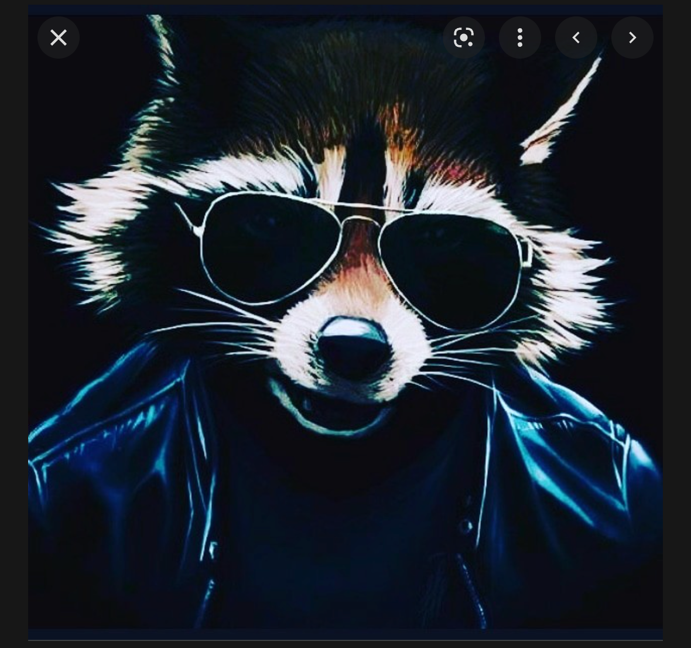
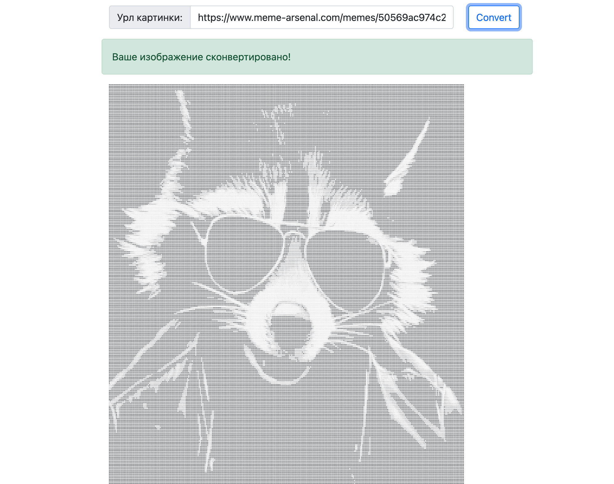

# Задача
Написать серверную часть конвертера в текстовую графику. Приложение умеет скачивать картинки по URL и конвертировать изображения в текстовую графику (т. е. текст из разных символов, которые в совокупности выглядят как изображение).

# Исходная картинка

# Итоговая картинка
